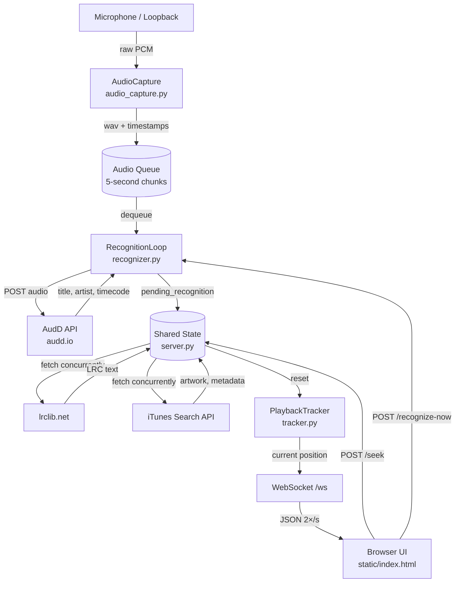

# live-music-lyrics

Displays synchronized lyrics for whatever song is playing through your speakers — in real time, in a browser. Point a microphone at the room (or use a loopback device), and the app listens continuously, fingerprints the audio, fetches LRC lyrics, and scrolls them in sync.


---

## What it does

- Captures microphone / loopback audio in 5-second chunks
- Fingerprints each chunk with the [AudD](https://audd.io/) API to identify the song
- Fetches time-synced LRC lyrics from [lrclib.net](https://lrclib.net/)
- Fetches album art, year, genre, and track count from the iTunes Search API
- Streams everything to a browser UI over WebSocket, updating every 500 ms
- Highlights the current lyric line and scrolls it to center
- Lets you click any lyric line to seek the tracker to that position
- Keeps a "Recently Played" history of up to 20 songs

---

## Architecture



### Thread / async model

| Component | Execution context |
|-|-|
| `AudioCapture` | sounddevice callback thread |
| `RecognitionLoop` | dedicated daemon thread |
| FastAPI + WebSocket | asyncio event loop (uvicorn) |
| Lyrics + album fetch | `asyncio.to_thread` (thread pool) |

`pending_recognition` is the handoff point: the recognition thread writes it; the async WebSocket loop reads and clears it.

---

## File structure

```
.
├── main.py                 # Thin launcher — imports and calls src.main.main()
├── src/
│   ├── main.py             # Entry point — wires AudioCapture, RecognitionLoop, FastAPI
│   ├── audio_capture.py    # Captures mic audio into 5-second WAV chunks
│   ├── recognizer.py       # Sends chunks to AudD; RecognitionLoop sleeps between songs
│   ├── server.py           # FastAPI app — WebSocket, /seek, /recognize-now endpoints
│   ├── tracker.py          # PlaybackTracker — converts a timecode anchor into live position
│   ├── lyrics.py           # Fetches + parses LRC from lrclib.net
│   ├── album_info.py       # Fetches artwork and metadata from iTunes Search API
│   ├── facts.py            # Fetches artist facts from Wikipedia
│   └── config.py           # Loads .env and exposes typed settings
├── tests/
│   ├── conftest.py         # pytest fixtures (WireMock container, test client)
│   ├── unit/               # Unit tests per module
│   └── integration/        # End-to-end server tests (REST + WebSocket)
├── requirements.txt        # Pinned production dependencies
├── requirements-dev.txt    # Test and lint tools
├── pyproject.toml          # pytest, coverage, and ruff config
└── static/
    └── index.html          # Single-page browser UI
```

---

## Setup

### Prerequisites

- Python 3.11+
- A free [AudD API key](https://dashboard.audd.io/)
- A microphone input or audio loopback device visible to sounddevice

### Install

```bash
pip install -r requirements.txt
```

### Configure

Copy `.env` and set your AudD key:

```bash
cp .env .env.local   # optional — or just edit .env directly
# set AUDD_API_KEY=your_key_here
```

Variables in `.env` are loaded automatically at startup. Shell environment variables always take precedence.

### Run

```bash
python main.py
```

The browser opens automatically at `http://localhost:8000`. Logs stream to stdout.

---

## Testing

The test suite uses **pytest** with **WireMock** (via Testcontainers) to stub all external APIs. Docker must be running before executing tests.

### Requirements

```bash
pip install -r requirements.txt -r requirements-dev.txt
```

### Run

```bash
pytest --cov --cov-report=term-missing --cov-fail-under=95
```

If you're using **Colima** as your Docker runtime, export the socket path first:

```bash
export DOCKER_HOST=unix:///~/.colima/default/docker.sock
export TESTCONTAINERS_RYUK_DISABLED=true
pytest --cov --cov-report=term-missing --cov-fail-under=95
```

The suite runs 113 tests and reaches **~98% line coverage**. The WireMock container starts once per session and is shared across all API-dependent tests.

---

## CI pipeline

The GitHub Actions pipeline (`.github/workflows/python-ci.yml`) runs on every push and pull request with two sequential jobs:

| Job | Steps | Gate |
|-|-|-|
| `security` | `bandit` (SAST) + `pip-audit` (CVE scan) | blocks `test` if any finding |
| `test` | `ruff` lint → `pytest --cov-fail-under=95` → upload `coverage.xml` to Codecov | fails PR if coverage drops below 95% |

---

## Environment variables

All settings have defaults except `AUDD_API_KEY`. The `.env` file in the repo root contains every variable with its default value and a description.

| Variable | Default | Description |
|-|-|-|
| `AUDD_API_KEY` | — | **Required.** AudD API key — get one free at [dashboard.audd.io](https://dashboard.audd.io/) |
| `HOST` | `0.0.0.0` | Interface the web server binds to |
| `PORT` | `8000` | Port the web server listens on |
| `LOG_LEVEL` | `INFO` | App log level: `DEBUG` \| `INFO` \| `WARNING` \| `ERROR` |
| `OPEN_BROWSER` | `true` | Auto-open browser on startup (`true`/`false`) |
| `SAMPLE_RATE` | `16000` | Microphone sample rate in Hz |
| `CHUNK_DURATION_S` | `5` | Seconds of audio per recognition attempt |
| `AUDIO_QUEUE_SIZE` | `10` | Max buffered audio chunks before drops |
| `LISTEN_BEFORE_END_S` | `5` | Seconds before song end to start listening for next track |
| `FALLBACK_INTERVAL_S` | `30` | Re-check interval (s) when song duration is unknown |
| `HISTORY_MAX` | `20` | Max entries in the Recently Played list |
| `FACT_ROTATION_S` | `9` | Seconds each fact is shown before rotating to the next |
| `AUDD_TIMEOUT` | `15` | HTTP timeout (s) for AudD API calls |
| `LYRICS_TIMEOUT` | `10` | HTTP timeout (s) for lrclib.net calls |
| `ALBUM_TIMEOUT` | `10` | HTTP timeout (s) for iTunes Search API calls |
| `FACTS_TIMEOUT` | `8` | HTTP timeout (s) for Wikipedia API calls |

---

## How sync works

Accurate sync requires knowing both *where* in the song we are and *when* that position was measured.

```
chunk_start ─────────────── chunk_end ──────── response
     │        5 s audio          │   network     │
     │                           │               │
 recording                   AudD timecode    HTTP done
                             (song position
                              at chunk_end)
```

1. `AudioCapture` records a 5-second WAV chunk and stamps it with `(chunk_start_time, chunk_end_time)`.
2. `recognize()` sends the WAV to AudD. AudD returns a timecode — the song position at the **end** of the submitted clip.
3. `recognize()` returns `timecode_s = audd_offset` and `ref_time = chunk_end_time`.
4. After lyrics and album art are fetched (which may take 2–3 s), `server.py` calls:
   ```python
   tracker.reset(timecode_s, reference_time=ref_time)
   ```
5. `PlaybackTracker.position()` then computes:
   ```python
   position = timecode_s + (time.monotonic() - ref_time)
   ```
   Because `ref_time` is the monotonic timestamp that matches `timecode_s`, the elapsed time since fingerprinting — including network latency and lyrics fetch — is automatically absorbed. No manual compensation is needed.

6. The WebSocket loop calls `tracker.current_line(lyrics)` every 500 ms and sends the result to the browser.

---

## How click-to-seek works

Each lyric line in the browser stores its LRC timestamp (`data-time-s`). Clicking a line:

1. **Optimistic update** — the browser immediately highlights that line and scrolls to it.
2. **Backend sync** — a `POST /seek` request sends `{ time_s }` to the server.
3. `server.py` calls `tracker.reset(time_s)` (using `time.monotonic()` as the new anchor).
4. `RecognitionLoop.seek(time_s)` recalculates how long to sleep before the next recognition (based on the new position relative to song duration).

The visual jump is instant; the backend confirms within one WebSocket tick (≤500 ms).

---

## Re-recognition

The "Recognize now" button triggers `POST /recognize-now`, which calls `recognition_loop.trigger_now()`. This interrupts any sleep the recognition loop is in and immediately captures a new chunk.

The recognition loop also re-triggers automatically when a song nears its end (`LISTEN_BEFORE_END_S = 5` seconds before duration).
